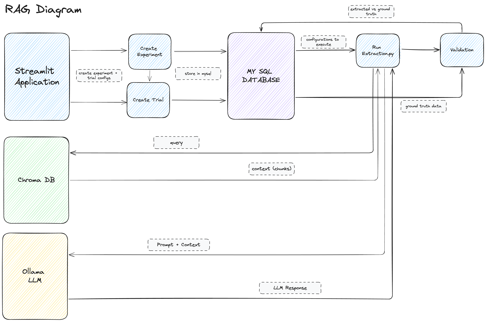

# fine_tune_llm

The purpose of this project is to test whether performing domain
adaptation on large language models increases their ability to perform certain
data retrieval tasks.

This project utilizes publically available Edgar SEC filings for the damain
data.

There are four sections to this project:

1.) Knowledge Stores
    - MySql Database: Used to store data on, including, but not limited to
        i. filing metadata
        ii. cleaned and chunked filing text.
    - Chromadb: Used to store and efficiently retrieve the filing metadata,
        chunked text and text embeddings.

2.) RAG & Validation Pipeline
    - Pipeline that tests the large language models ability to retrieve
        data attributes from the filings.
    - Relies on retrieval augmented generation.
    - Query: utilized to retrieve the most relevant chunks of text from
        Chromadb.
    - Prompt: instructions to LLM to extract text from underlying documents.
    - Prompt + Query: constitutes rag where we send the chunks + prompt to the
        llm.
    - Extraction: LLM response.
    - Validation: compare LLM response to validation dataset.
    - NOTE:  Validation pipeline will store all data at the extraction level
        and be structured around experiments & trials.

3.) Domain Adaptation
    - Fine tuning of large language models on edgar filing data.
    - This process requires the preprocessing of the edgar filings.
    - Thereafter, we instantuate a huggingface trainer class and fine tune
        model.
    - Weights and checkpoints for each fine tuned model will be saved to
        the local drive and metadata about the training run will be saved to
        a table in the MySql Database.

4.) Streamlit Application.
    - Here we create a gui interface for the user to
        - define experiments
        - define trial configurations
        - save these configurations to the MySql database.
        - kick off an extraction and validation run utilizing as input the
          experiment & trial configurations.

        

# Transformation Pipeline (see: fine_tune_llm/transforms)
- create-base-sql-tables:
    script to programatically build the required mysql tables.
- unpack-filing-archives:
    the edgar filings that were copied from arc.insight
    reside in gzip archives.  This code extracts them into a single txt
    directory for downstream preprocessing.
- unpack-validation-archives:
    the edgar financial-statement data used for validation reside in archives
    within which are a set of N unique files.  This code goes into each archive
    extracts the file & saves it to the validation/raw directory.
- clean-text: this code takes as input the raw-text files, cleans them of
    html and other noisy text and then writes them to a clean files directory.
- build-filing-index-table:
    This code takes as input the files in the clean-text directory.
    For each file it searches for a set of 6 metadata variables.
    It then upserts the file name + metadata variables to mysql, effectively
    creating a filing index table of all filings.
    metadata fields: cik, filing type, filing date, company name, cik, irs num.
- build-filing-chunk-table:
    Takes as input the directory w/ clean text files.
    Chunks each filing and uploads chunks to a mysql table.
    Chunk table relates to filing-index table via foreign key.
- create-collection:
    Code that creates that chromadb edgar-filing collection from
    i.) the filing-index table used for metadata
    ii.) the filing-chunk table.
    iii.) embeddings of chunked text.
- build-validation-mysql-tables:
    Code that automates building the validation mysql tables.
- build-validation-datasets
    Code that automates the insertion of validation data into the validation
    mysql tables. 

# Validation Datast
- The validation dataset for this project is financial statement data obtained
    from the edgar web page.  The data is made availabe in bulk in tab delimited
    files and archived by year and fiscal quarter.
- This data is ideal for this type of project as the data that we will attempt
    to retrieve from the edgar sec filings should be the same as the
    data (ex: annual revenues for Ford Motor Company for 2022) edgar makes
    available in these bulk documents.
- https://www.sec.gov/about/dera_financial-statement-data-set
- data dictionary: https://www.sec.gov/files/aqfs.pdf

# TODO
- Add log handler & log file.  Replace print with logs.
- Change hardcoded directory & paths to config
- Validation Dataset
    - Each company may have a different name for a given variable.
        For example, not all filings may use NetIncomeLoss.  This will cause
        issues for programatically validating runs if we don't know the correct
        mapping
    - It appears that the naming convention in the validation dataset is a
    concatenation of words.  Example "NetIncomeLoss".  We may need to separate
    these words in our prompts, which means we will need to know how to separate
    them.
    - Suggestion: We have a finite list of currated validation fields.
    - Validation-Sub: Appears to be empty.  Run insertion for for this dataset.

# References

### Filing Definitions
Accession Number: uniuqe ID given to each filing.
    It combines the CIK id

